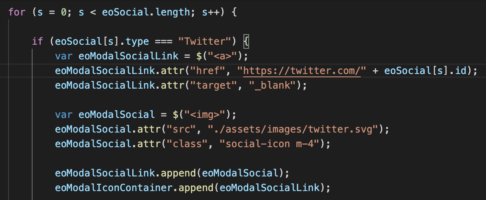
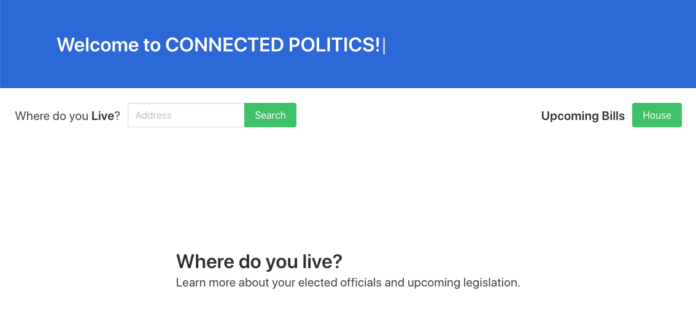
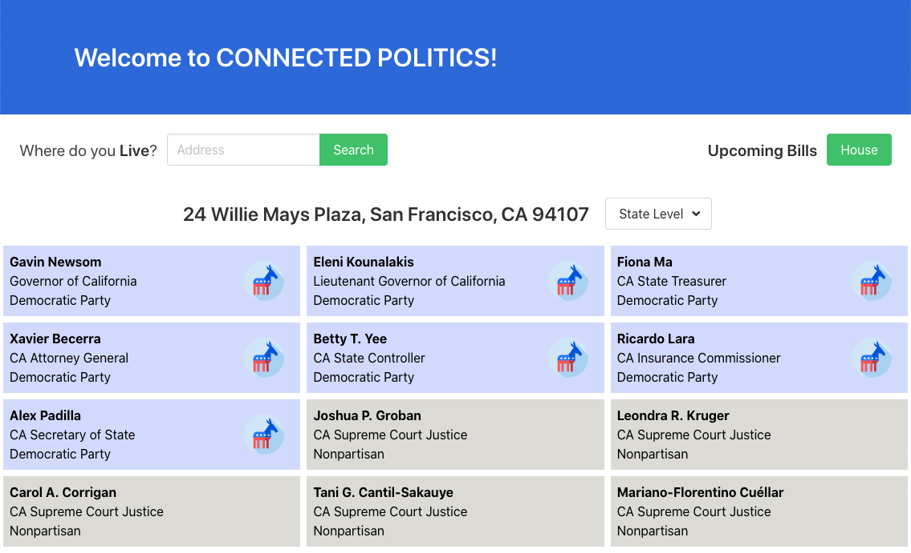
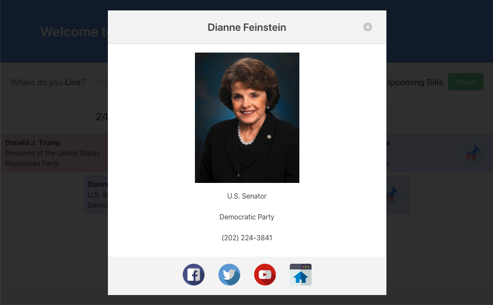
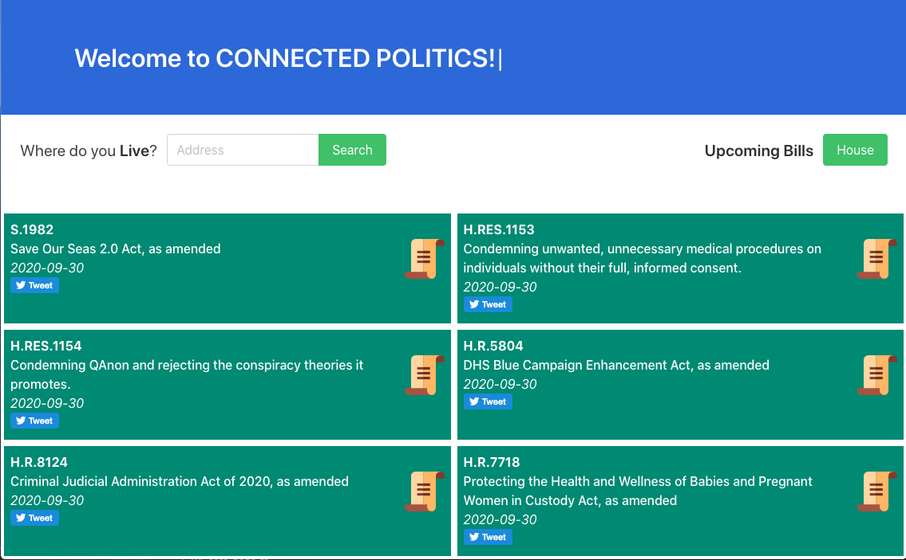

# CONNECTED POLITICS

## Description

Create an application that uses two or more API's, AJAX to pull the data from it, at least one new library or technology that hasn't been discussed in class, and have a polished front end/UI. Also the project must meet good quality coding standards, not use any alerts, confirms, or prompts, have a repeating element, a CSS framework other than Bootstrap, must be deployed, have User Input Validation, must be interactive, and have some repeating element/table. 

We created an application that uses a pro publica API to pull pending legislation that is about to be voted on by our elected officials and a google civil information API to pull the federal, state, and local elected officials from a user's address with a search function on the app. We chose Bulma as our CSS framework because it is adaptive to AJAX created cards and columns and looks great. We used typed.js to give the application more visual appealing and we didnt't use any prompts, confirms, or alerts.

## Built With

- HTML
- CSS
- Javascript
- jQuery
- AJAX
- [Bulma CSS](https://www.bulma.io)
- [Typed.js](https://github.com/mattboldt/typed.js/blob/master/README.md)
- [Google Civil Information API](https://developers.google.com/civic-information)
- [ProPublica API](https://projects.propublica.org/api-docs/congress-api/bills/)
- [Baloon CSS](https://kazzkiq.github.io/balloon.css/)

## How to Use this Application

Simply type your address in the search bar and you will be able to find out who your Federal, State, and Local representatives are! Click on the upcoming bills button and you will be able to check out all of the pending legislation that your elected officials will be voting on! Click on the scoial media icons to share your opinion!

## What makes this project stand out?

This app gives users the ability to not only find their Federal, State, and Local representatives but also reach out to them through social media! Users also have the abillity to find upcoming legislation and share it through social media as well!

## Code Highlights

Here we used a for loop to find the social media tags is the google civic API and add them to the social media link with an 'a' tag, src, and class. We used 'if else' statements in the rest of the for loop for the other social media tags in the API.

# Deployed Link
- https://anusontarangkul.github.io/connected-politics/

## Authors

### David Anusontarangkul
- https://github.com/anusontarangkul
- https://www.linkedin.com/in/anusontarangkul/

### Jonathan-David Martinez
- https://github.com/Goodlvn
- https://www.linkedin.com/in/jonathan-martinez-316406113/

### Ry Hull
 - https://github.com/ryandelonhull
 - linkedin.com/in/ryan-hull-94003144

 ## *Acknowledgments*

 Thank you to Roger, Kerwin, and Manuel for having us ready to take on a project like this. 

